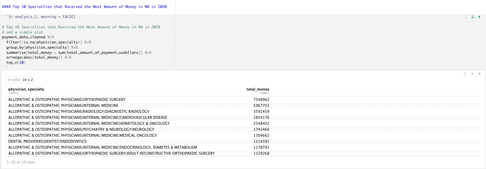
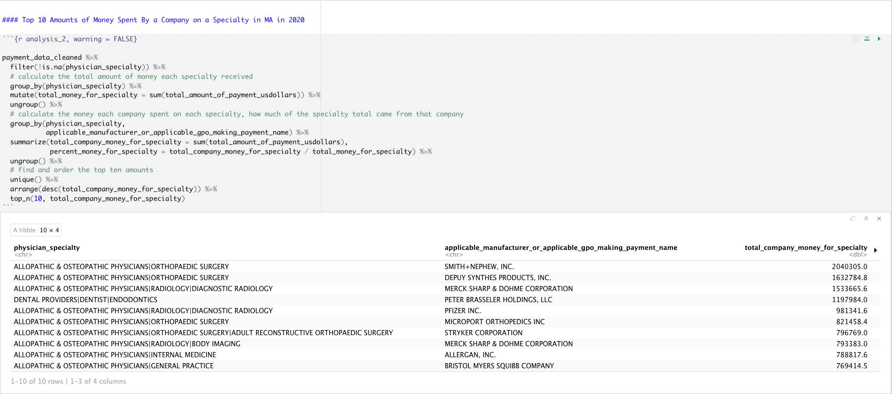
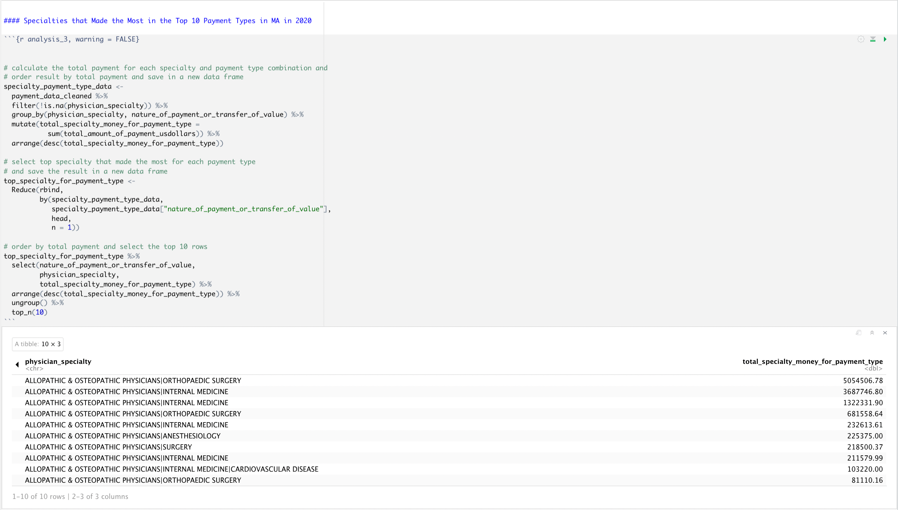

> Wrangled the [**Open Payment**](https://openpaymentsdata.cms.gov/) dataset in order to reveal findings about the financial relationships between drug and device companies and certain healthcare providers in Massachusetts.

## Table of Contents

1. [About the Dataset](#about)
    
2. [Analysis](#findings)

    a. [Explore the Payment that Each Physician Specialty Received](#first-part)
    
    b. [Explore the Money Amount Manufacturers and GPOs Spent on Specialties](#second-part) 

    c. [Explore the Specialties that Made the Most in the Top Payment Types](#third-part) 

3. [Key Finding and Ethical Concern](#ethical)

## 1. About the Dataset
[Back to ToC](#toc)

The dataset I used was from the Open Payments which was created and is managed by the Centers for Medicare & Medicaid Services in order to make the financial relationships between hospitals and physicians and drug and device companies obvious. This includes information like what hospital, the amount of the payment, the type of payment, etc. to help the public be more informed. Thus, our overarching question was: how does the physician's specialty affect the payment they receive? Specifically, we wanted to investigate specialties in relation to money, companies, and payment types.

## 2. Findings from the Analysis
[Back to ToC](#toc)

#### 2.a Explore the Payment that Each Physician Specialty Received

The first part of my analysis explored the total amount of payment that each physician specialty received. By organizing them into a top ten list, we found that physicians specializing in orthopedic surgery in Massachusetts received the most money overall, about $7.5 million. Most of the other entries in the list were other types of allopathic and osteopathic physicians, particularly ones working in internal medicine. 

#### 2.b Explore the Money Amount Manufacturers and GPOs Spent on Specialties
 
The second part of my analysis explored the amount of money that individual manufacturers and GPOs spent on different specialties. We found that Smith+Nephew Inc. spent the most amount of money on one specialty, about $2 million on orthopedic surgery, which made up 27% of the total money received by orthopedic surgeons. The table shows that companies that spend a large amount of money can make a significant impact on a particular specialty. 
 

 
#### 2.c Explore the Specialties that Made the Most in the Top Payment Types
 
The third part of my analysis studied the types of payment and the physician specialty they went to the most. This showed that the largest total amount for a specialty in a certain payment type was the $5 million spent on orthopedic surgery in the form of royalties and licenses. The next largest was $3 million in consulting fees for internal medicine, which shows that different specialties received most of their money in different payment types. 

      
## 4. Key Finding and Ethical Concern
[Back to ToC](#toc)

The key finding from this dataset is that the payment from drug and device companies is not distributed evenly across all health care providers. Certain specialties receive more money in certain areas. For example, orthopedic surgeons received the most money from drug and device companies, especially as royalty and license fee. The Centers for Medicare & Medicaid Services (CMS) has a say in data collection and analysis regarding this dataset. The drug and device companies, the health care providers and the patients and their advocates who utilize the dataset have been excluded from the data collection and analysis process.The assumption is that the reporting entities report the data honestly, accurately and thoroughly. The commitment is to make the health care system more transparent for the public.The benefit of this dataset is that it provides a tool for the public to search for payments and data analysts to gain insights on the financial relationships between the drug and device companies and health care providers. One of the harm of this dataset is that since the information available on the database is open to personal interpretation, there is a possibility for misunderstanding and misinterpretation.